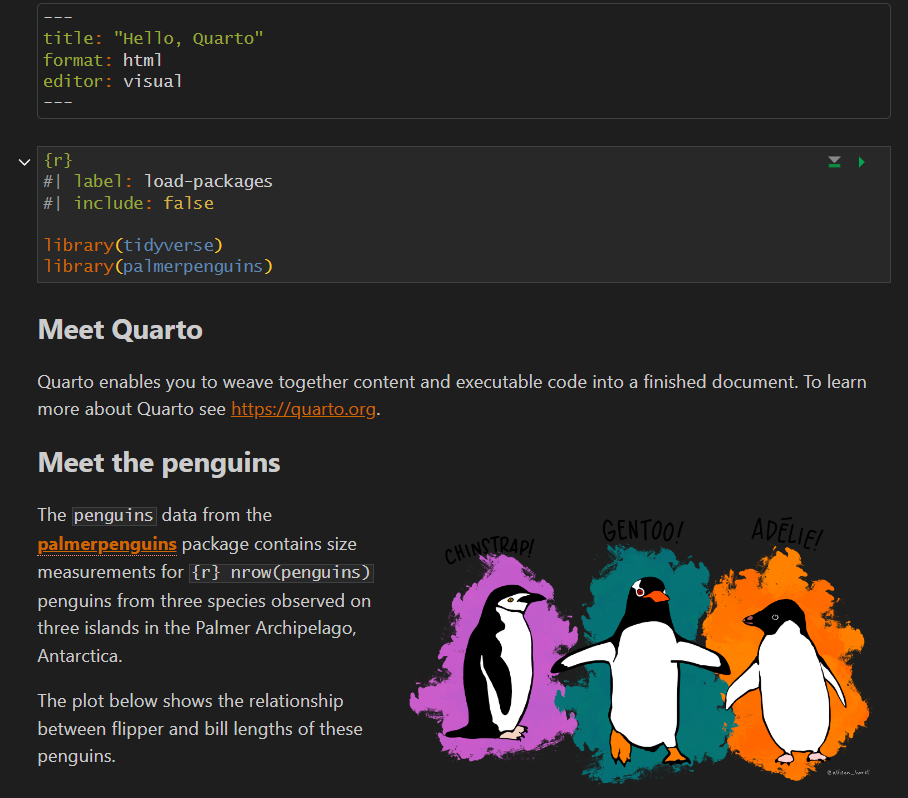
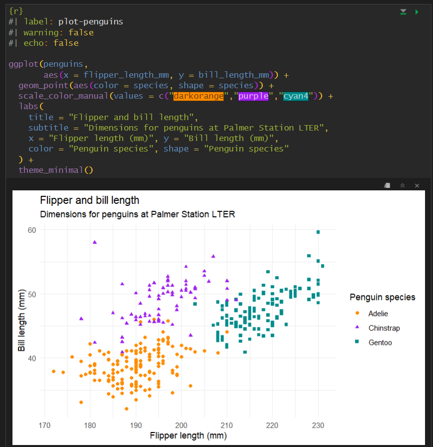

# One Monokai theme for RStudio
A dark theme for the RStudio IDE. Based on [this theme for VS Code](https://github.com/anthonynorth/rscodeio).

To install, download the [OneMonokai.tmTheme](https://github.com/jcasasn/rstudio-theme-one-monokai/blob/main/One%20Monokai.tmTheme) file, then in RStudio go into:      
Tools > Global Options... > Appearance tab, and under Editor theme select 'Add...' and select the file.

## Screenshots

